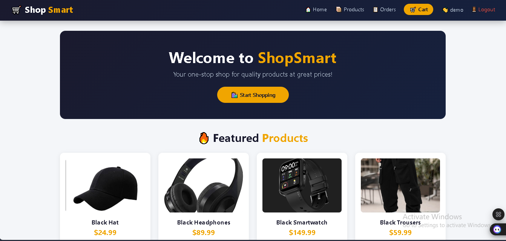
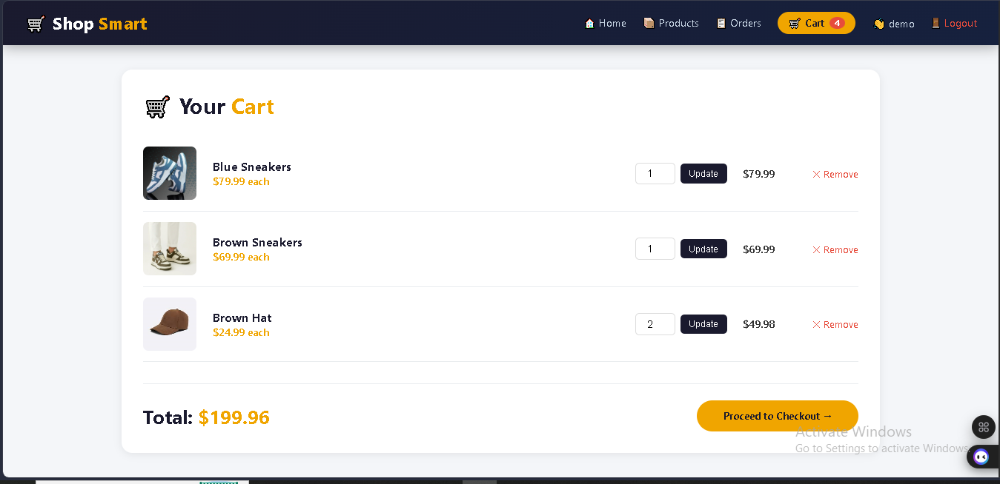
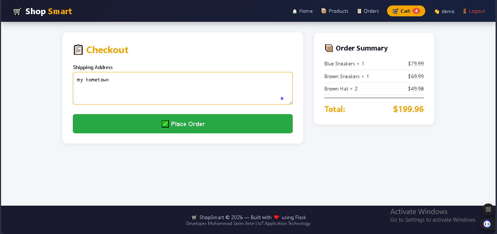

# 🛒 Flask E-Commerce Web Application

A modern E-Commerce web application built using **Flask**, **SQLite**, **HTML**, **CSS**, and **JavaScript**. The application allows users to browse products, view product details, manage a shopping cart, register/login, and place orders through a clean and user-friendly interface.

---

## ✨ Features

- User Registration & Login
- Product Catalog
- Product Details Page
- Shopping Cart
- Checkout System
- Order Management
- SQLite Database Integration
- Responsive User Interface

---

## 🛠️ Tech Stack

- Python
- Flask
- SQLite
- HTML5
- CSS3
- JavaScript

---

## 📂 Project Structure

```
app.py
shopping.db
templates/
static/
README.md
```

---

## 🚀 Getting Started

### 1. Clone the repository

```bash
git clone https://github.com/sarimamirdev/flask-ecommerce-app.git
```

### 2. Open the project

```bash
cd flask-ecommerce-app
```

### 3. Install dependencies

```bash
pip install flask
```

### 4. Run the application

```bash
python app.py
```

---

## 🗄️ Database Initialization

After starting the Flask application for the first time, initialize or reload the database by visiting:

```
http://127.0.0.1:5000/init_db
```

or

```
https://your-domain.com/init_db
```

This endpoint will create/load the required database tables and sample data for the application.

> **Note:** Run `/init_db` only when setting up the project or when you need to reinitialize the database.

---

## 📸 Application Screenshots

You can add screenshots here.

Example:

```
screenshots/
│── home.png
│── products.png
│── product-details.png
│── cart.png
│── checkout.png
│── login.png
```

Then display them like this:

### Home Page



### Products


### Shopping Cart



### Checkout



---

## 👨‍💻 Author

**Muhammad Sarim Amir**

GitHub:
https://github.com/sarimamirdev

LinkedIn:
https://www.linkedin.com/in/muhammad-sarim-amir-477b76368/

---

## 📄 License

This project is licensed under the MIT License.
